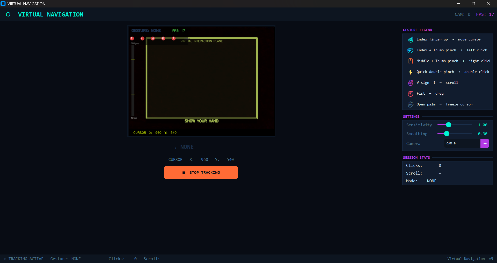

# Virtual Navigation

A real-time, hand-gesture-based virtual mouse controller built in Python. This project replaces a physical mouse with an AI-driven vision system tracking your hands via webcam. 

**Virtual Navigation** utilizes the MediaPipe GestureRecognizer neural-network model for robust pose classification and intercepts the Windows OS at the hardware level (`ctypes.SendInput`) for zero-latency, absolute-precision cursor control.

---

## Interface



The application features a fully custom, hardware-accelerated GUI built with `CustomTkinter`. 

Key visual elements include:
- **Live Camera Feed HUD**: Draws an estimated "Virtual Interaction Plane" to guide hand placement for optimal tracking.
- **T/I/M/R/P Visualiser**: The top-left corner displays a live debugging array representing the extension state of every finger (Thumb, Index, Middle, Ring, Pinky).
- **Session Stats**: Live gesture display, click counters, framing rate (FPS), and absolute OS cursor coordinates.
- **Dynamic Styling**: Dark-mode neon styling with animated pulse elements that react to the current tracking state (idle vs. active).

---

## Architecture and How It Works

To achieve a lag-free experience, the project uses a highly optimized decoupled pipeline running across three asynchronous execution threads:

1. **Camera Capture Thread**: Dedicated exclusively to polling the webcam at hardware speeds. It maintains only the absolute newest frame and actively drops stale frames, preventing internal buffer buildup.
2. **Inference Thread**: Consumes the newest raw frame and executes the MediaPipe ML model. It runs gesture classification rules, applies Exponential Moving Average (EMA) smoothing to the coordinates, and issues direct OS-level memory instructions via `ctypes` to update the cursor.
3. **Main UI Thread**: Handles the CustomTkinter graphical window and updates the visual overlay at a smooth ~30 FPS, completely independent of the inference workload.

### Gesture Pipeline
Rather than relying on fragile manual knuckle-angle mathematics, the core gesture state (Open Palm, Closed Fist, Pointing Up, etc.) is evaluated by the trained neural network. 

However, because the base ML model cannot natively detect precise finger "pinching", the pipeline overlays a fast 3D spatial distance check on the 21 generated landmarks to confidently trigger clicks instantly without relying on a debounce timer. 

---

## Project Structure

```text
Virtual Navigation/
├── main.py                   # Entry point, UI loop, and Thread management
├── gesture_detector.py       # Wrapper for MediaPipe GestureRecognizer initialization
├── gesture_classifier.py     # State machine mapping ML labels & spatial rules to actions
├── mouse_controller.py       # Direct ctypes Windows API integration and EMA smoothing
├── requirements.txt          # Python dependencies
├── gesture_recognizer.task   # The base MediaPipe ML Model (must be downloaded)
├── icon.ico                  # Application binary icon
├── demo_screenshot.png       # Front-end preview image
└── README.md                 # Project documentation
```

---

## Key Features

- **Hardware-Level Input**: Bypasses traditional Python abstraction libraries (`pyautogui`) in favor of direct OS `SendInput` calls, completely eliminating input latency and thread blocking.
- **Edge-Triggered Clicks**: Input state machines fire immediately when a gesture transition is detected, ensuring clicks are as instantaneous as a physical hardware switch.
- **Intelligent EMA Damping**: Low-pass adaptive Exponential Moving Averages (EMA) that dynamically shift based on cursor speed. The cursor moves fluidly when making broad sweeps but tightens exponentially to eliminate micro-jitter when holding still.
- **Pinch Hysteresis**: Requires the pinching fingers to pull significantly further apart to release a click than to engage one, guaranteeing immunity to double-click input spam.

---

## Supported Gestures

| Hand Pose | System Action | Internal Flow |
|:---|:---|:---|
| **Index finger up** | Move cursor | Maps to ML rule: `Pointing_Up` |
| **Index + Thumb pinch** | **Left click** | 3D spatial check; holding pinch triggers Drag |
| **Middle + Thumb pinch** | **Right click** | 3D spatial check with index extension guard |
| **Quick double pinch** | **Double click** | Edge-triggered timing rule (<400ms gap) |
| **V-sign (Move ↕)** | **Scroll up/down** | Maps to ML rule: `Victory`. Active Y-axis polling |
| **Fist** | **Drag & Drop** | Maps to ML rule: `Closed_Fist` |
| **Open palm** | **Pause tracking** | Maps to ML rule: `Open_Palm`. Freezes coordinates |

> **Fail-safe**: Move your physical mouse to the absolute **top-left corner** of your screen at any time to trigger the OS-level fail-safe.

---

## Installation & Usage

1. **Clone the repository** and install the base dependencies:
   ```bash
   pip install -r requirements.txt
   ```
2. **Download the MediaPipe Model** (Required):
   You must place the `gesture_recognizer.task` file into the root directory. You can download the official model directly from Google here:
   [Download gesture_recognizer.task](https://storage.googleapis.com/mediapipe-models/gesture_recognizer/gesture_recognizer/float16/latest/gesture_recognizer.task)

3. **Run the Application**:
   ```bash
   python main.py
   ```
4. Click **START TRACKING** inside the application window and raise your hand into the camera's view. Stay approximately 30-50cm away for optimal detection.

---

## Contributing and Collaboration

This project is open-source and actively seeking contributors. While the core architecture, threading pipeline, and zero-latency drivers are fully established, there are still ongoing challenges with edge-case gesture accuracy, false-positives under poor lighting conditions, and strict tilt angles.

If you have experience with computer vision, machine learning algorithms, spatial geometry tuning, or general software optimization, collaboration is highly encouraged. Please feel free to fork the repository, open issues to discuss potential improvements, or submit pull requests. Let's build a more robust system together.
